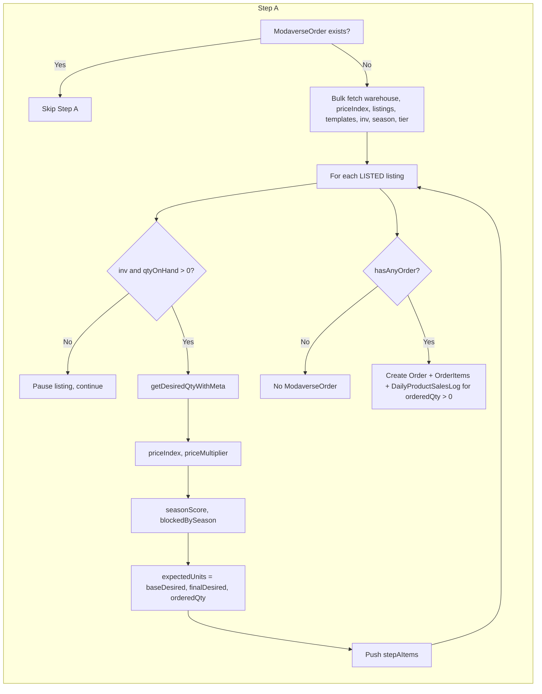
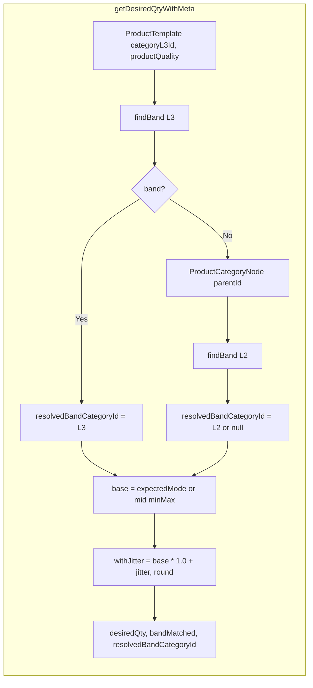

# Step A – Order Generation Implementation Report

Precise report of the current "Step A - Order Generation" implementation in ModaVerse: algorithm steps, demand logic, data dependencies, and exact modification points.

---

## 1. Current Step A Algorithm

**File:** [lib/game/run-warehouse-day-tick.ts](../lib/game/run-warehouse-day-tick.ts)

- **Idempotency guard:** Lookup `ModaverseOrder` by `warehouseBuildingId_dayKey` (lines 30–37). If `existingOrder` exists, skip all of Step A (no order generation, no writes).
- **Bulk fetches (only when no existing order):**
  - Warehouse: `CompanyBuilding` by `warehouseBuildingId` → `marketZone` (default `USA`).
  - Price index: `MarketZonePriceIndex` by `warehouseMarketZone` → `multiplier`, `isActive`.
  - Listings: `ShowcaseListing` where `companyId`, `warehouseBuildingId`, `status: LISTED`, ordered by `createdAt`, `id`; select `id`, `productTemplateId`, `playerProductId`, `salePrice`, `listPrice`.
  - Templates: `ProductTemplate` by `id in templateIds`; select `id`, `suggestedSalePrice`, `seasonScenarioDefinitionId`, `productSeason`.
  - Inventory: `BuildingInventoryItem` by `companyBuildingId`, `productTemplateId in templateIds`; select `productTemplateId`, `id`, `qtyOnHand`, `avgUnitCost`.
  - Season: distinct `seasonScenarioDefinitionId` from templates → `MarketZoneSeasonScenario` by `definitionId`, `marketZone`, `isActive`; select `definitionId`, `weeksJson`. Build `seasonMap` (definitionId → weeks array). `weekIndex0 = getWeekIndex0FromDayKey(normalizedDayKey)`.
  - Tier: `BuildingMetricState` by `buildingId`, `metricType: SALES_COUNT` → `currentLevel`; `tierUsed = clamp(currentLevel ?? 1, 1, 5)`.
- **Per listing loop:**
  - Skip if no `inv` or `inv.qtyOnHand <= 0`: update listing to PAUSED / OUT_OF_STOCK, then `continue`.
  - Skip if no `template` → `continue`.
  - Call `getDesiredQtyWithMeta(listing.productTemplateId, tierUsed, tx, { companyId, warehouseBuildingId, dayKey: normalizedDayKey })`; set `baseDesired = demandMeta.desiredQty`.
  - **Price:** `priceIndex = computePriceIndex(salePrice, suggestedSalePrice, multiplier)`; if `<= 0` or not finite → `priceIndex = 1`. `priceMultiplier = getPriceMultiplier(priceIndex)`. `blockedByPrice = (priceMultiplier === 0)`.
  - **Season:** `weeks = template.seasonScenarioDefinitionId ? seasonMap.get(definitionId) : undefined`. `missingSeasonScenario = !weeks`. `seasonScore = weeks ? clamp(weeks[weekIndex0] ?? 100, 0, 100) : 100`. `blockedBySeason = (seasonScore === 0)`.
  - **Quantities:** `expectedUnits = baseDesired`. `finalDesired = round(expectedUnits * priceMultiplier)`; if `seasonScore === 0` then `finalDesired = 0`. `orderedQty = min(finalDesired, inv.qtyOnHand)`; throw if `orderedQty < 0`.
  - Push to `stepAItems` (listing, inv, template, baseDesired, expectedUnits, priceIndex, priceMultiplier, seasonScore, orderedQty, blockedByPrice, blockedBySeason, missingSeasonScenario, tierUsed, bandMatched, resolvedBandCategoryId).
- **Gating rules (effect on quantity, not on "skip listing"):**
  - **priceMultiplier === 0** → `finalDesired` becomes 0 (via `expectedUnits * 0`).
  - **seasonScore === 0** → `finalDesired` explicitly set to 0.
  - **Out of stock** → listing paused and skipped from order (no item added to `stepAItems` for that listing).
- **Writes (only when `!existingOrder` and `hasAnyOrder`):**
  - Create one `ModaverseOrder` (companyId, warehouseBuildingId, dayKey).
  - For each `stepAItem` with `orderedQty > 0`: create `ModaverseOrderItem`; upsert `DailyProductSalesLog` (create/update with `qtyOrdered`, `expectedUnits`, `seasonScore`, `priceIndex`, `reasonsSnapshot`, sale/list price). If `newQtyOnHand === 0`, update listing to PAUSED / OUT_OF_STOCK.
  - **Skipped writes:** Items with `orderedQty === 0` do not get `ModaverseOrderItem` or `DailyProductSalesLog` (loop at 208: `if (item.orderedQty === 0) continue`).
- **reasonsSnapshot (stored in DailyProductSalesLog):** Object with `baseDesired`, `expectedUnits`, `priceIndex`, `priceMultiplier`, `seasonScore`, `tierUsed`, `bandMatched`, `resolvedBandCategoryId`, `blockedByPrice`, `blockedBySeason`, and optionally `missingSeasonScenario: true` (lines 224–236).

---

## 2. Current Demand Algorithm

**File:** [lib/game/demand.ts](../lib/game/demand.ts)

- **Category resolution (L3 then L2 parent):**
  - Load template: `ProductTemplate` by `productTemplateId`; select `categoryL3Id`, `productQuality`. If no template → return `{ desiredQty: 0, bandMatched: false, resolvedBandCategoryId: null }`.
  - Call `findBand(client, template.categoryL3Id, template.productQuality, tier)`. If band found → `resolvedBandCategoryId = template.categoryL3Id` (L3).
  - If no band: load `ProductCategoryNode` by `template.categoryL3Id`; select `level`, `parentId`. If `level === L3` and `parentId` present, call `findBand(client, node.parentId, template.productQuality, tier)`; if band found → `resolvedBandCategoryId = node.parentId` (L2).
- **Band lookup (`findBand`):** `ProductSalesBandConfig` where `categoryL3Id`, `productQuality` (STANDARD/PREMIUM/LUXURY), `isActive: true`, `tierMin <= tier`, `tierMax >= tier`; select `minDaily`, `maxDaily`, `expectedMode`. Returns first match or null.
- **Base and desiredQty (when band exists):** `base = band.expectedMode ?? Math.round((band.minDaily + band.maxDaily) / 2)`. `potentialMultiplier = 1.0`. `withPotential = base * potentialMultiplier`. `withJitter = withPotential + jitter(withPotential)`. `rounded = Math.max(0, Math.round(withJitter))`. Optional `MODAVERSE_TEST_DEMAND_MULT` scales result; else `desiredQty = rounded`. Return `{ desiredQty, bandMatched: true, resolvedBandCategoryId }`.
- **No band:** `base = 1`, same jitter and rounding and test mult; return `{ desiredQty, bandMatched: false, resolvedBandCategoryId: null }`.
- **Jitter:** `JITTER_FRACTION = 0.15`. `range = value * 0.15`. Result is uniform in `[-range, +range]`. With `seedContext` and `productTemplateId`: seed string `companyId:warehouseBuildingId:dayKeyStr:productTemplateId` → `seededFloat(seed)` → `(t*2-1)*range` (deterministic). Without seed: `(Math.random()*2-1)*range`.
- **Meta returned:** `desiredQty`, `bandMatched` (true iff a band was used), `resolvedBandCategoryId` (L3 id or L2 parent id when band matched).

---

## 3. Data Dependencies

| Source | Fields / usage |
|--------|-----------------|
| **ModaverseOrder** | Idempotency: `warehouseBuildingId`, `dayKey`. |
| **CompanyBuilding** | `marketZone`. |
| **MarketZonePriceIndex** | `multiplier`, `isActive`. |
| **ShowcaseListing** | `id`, `productTemplateId`, `playerProductId`, `salePrice`, `listPrice`; filter `status: LISTED`. |
| **ProductTemplate** | `id`, `suggestedSalePrice`, `seasonScenarioDefinitionId`, `productSeason`; demand also uses `categoryL3Id`, `productQuality`. |
| **BuildingInventoryItem** | `productTemplateId`, `id`, `qtyOnHand`, `avgUnitCost`. |
| **MarketZoneSeasonScenario** | `definitionId`, `marketZone`, `isActive`, `weeksJson`. |
| **BuildingMetricState** | `currentLevel` for `metricType: SALES_COUNT`. |
| **ProductSalesBandConfig** | `categoryL3Id`, `productQuality`, `tierMin`, `tierMax`, `minDaily`, `maxDaily`, `expectedMode`, `isActive`. |
| **ProductCategoryNode** | `level`, `parentId` (for L3 → L2 fallback). |
| **ModaverseOrderItem** | Created: `orderId`, `listingId`, `productTemplateId`, `playerProductId`, `qtyOrdered`, `qtyFulfilled`, `qtyShipped`, `sortIndex`, `salePriceUsd`. |
| **DailyProductSalesLog** | Upsert: `listingId`, `dayKey`, `companyId`, `marketZone`, `warehouseBuildingId`, `productTemplateId`, `playerProductId`, `qtyOrdered`, `qtyShipped`, `expectedUnits`, `seasonScore`, `priceIndex`, `reasonsSnapshot`, `salePrice`, `listPrice`. |

Helpers: `normalizeUtcMidnight`, `getWeekIndex0FromDayKey` (season), `computePriceIndex`, `getPriceMultiplier` (price-index.ts).

---

## 4. Where expectedMode Drives expectedUnits / desiredQty

- **demand.ts**
  - **getDesiredQtyWithMeta** (line 111–112): `base = band.expectedMode ?? Math.round((band.minDaily + band.maxDaily) / 2)`; this `base` is then multiplied by 1.0, jittered, and rounded to produce `desiredQty`. So `expectedMode` (when set) is the sole driver of the band's base before jitter.
  - **getDesiredQty** (line 169–171): same formula for `base` when a band exists; `expectedMode` drives the returned `desiredQty` the same way.
- **run-warehouse-day-tick.ts**
  - **expectedUnits** (line 167): `expectedUnits = baseDesired`, and `baseDesired = demandMeta.desiredQty` (line 147). So `expectedUnits` is the demand output (which is driven by `expectedMode` when a band exists and has `expectedMode` set). There is no separate "expected mode" value stored; the band's `expectedMode` only affects the number through `getDesiredQtyWithMeta` → `desiredQty` → `baseDesired` → `expectedUnits`.

So: **expectedMode** is used only inside [demand.ts](../lib/game/demand.ts) in the two places above to choose the band's base value; Step A then uses that as `baseDesired`/`expectedUnits` and applies price/season and inventory caps.

---

## 5. Where to Modify

| Goal | Location |
|------|----------|
| Change idempotency / skip logic for Step A | [run-warehouse-day-tick.ts](../lib/game/run-warehouse-day-tick.ts) lines 30–39 (`existingOrder` check). |
| Change which listings are considered | Lines 54–68 (listings query: status, warehouse, company). |
| Change price gating / multiplier | [price-index.ts](../lib/game/price-index.ts) `getPriceMultiplier`, `computePriceIndex`; tick file lines 152–166 (priceIndex, priceMultiplier, blockedByPrice). |
| Change season gating / score | Lines 162–166 (weeks, seasonScore, blockedBySeason); `getWeekIndex0FromDayKey` in season-score module. |
| Change expectedUnits / finalDesired / orderedQty formula | Lines 167–171 (expectedUnits = baseDesired, finalDesired, orderedQty). |
| Change demand (band → desiredQty) | [demand.ts](../lib/game/demand.ts) `getDesiredQtyWithMeta` (lines 69–119): category resolution (84–97), band lookup (41–57), base/expectedMode (110–112), jitter (99, 114), test mult (115–117). |
| Change jitter range | [demand.ts](../lib/game/demand.ts) line 15 `JITTER_FRACTION`, function `jitter` (183–196). |
| Change band lookup (tier/quality/category) | [demand.ts](../lib/game/demand.ts) `findBand` (41–57). |
| Use min/max/expectedMode differently (e.g. draw in [min,max]) | [demand.ts](../lib/game/demand.ts) lines 110–117 (base and rounding). |
| Change what is written to ModaverseOrder/ModaverseOrderItem | [run-warehouse-day-tick.ts](../lib/game/run-warehouse-day-tick.ts) lines 201–224. |
| Change DailyProductSalesLog or reasonsSnapshot | Lines 224–269 (reasonsSnapshot object 224–236; upsert 238–269). |
| Skip creating order when all zero | Lines 196–200 (`hasAnyOrder`, "Do not create ModaverseOrder when all items are zero"). |
| Out-of-stock pause behavior | Lines 127–146 (per-listing skip + listing update); 270–280 (post-order zero stock update). |

---

## Summary Diagram

This is the full picture of Step A and demand for safe modification.
